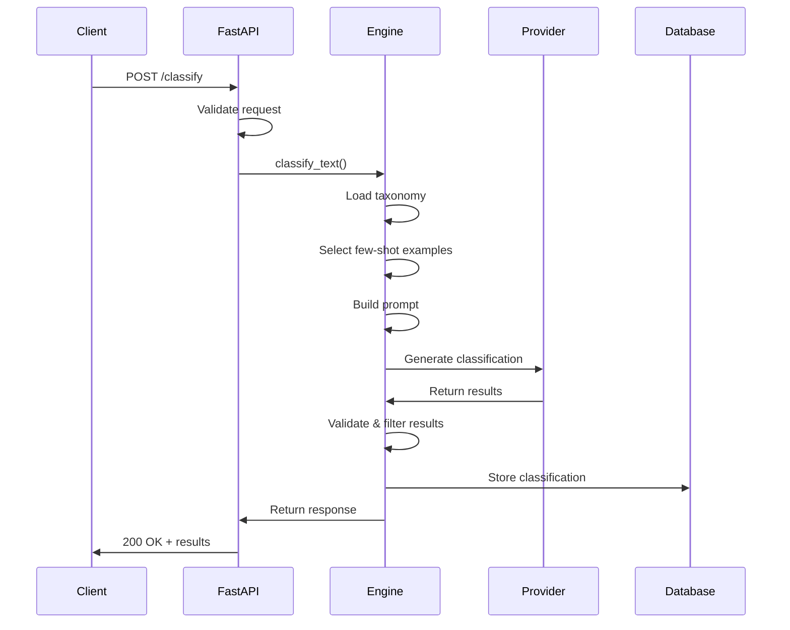
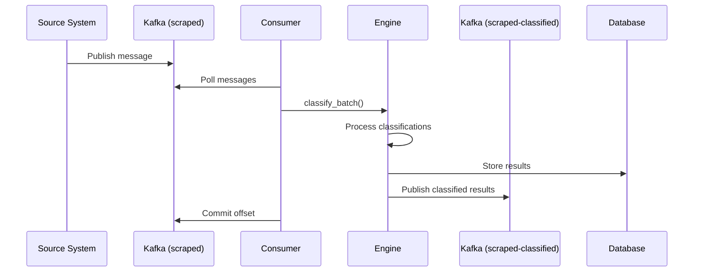
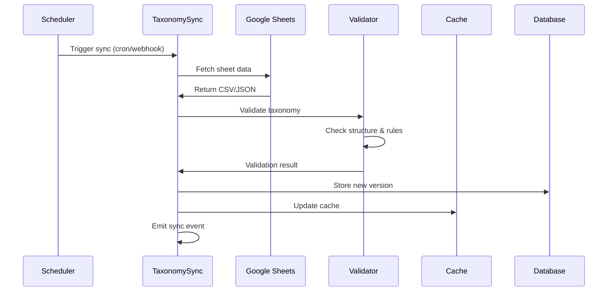

# 4. Data Flow Architecture

## 4.1 Synchronous Classification Flow

```mermaid
sequenceDiagram
    participant C as Client
    participant A as FastAPI
    participant E as Engine
    participant P as Provider
    participant D as Database
    
    C->>A: POST /classify
    A->>A: Validate request
    A->>E: classify_text()
    E->>E: Load taxonomy
    E->>E: Select few-shot examples
    E->>E: Build prompt
    E->>P: Generate classification
    P->>E: Return results
    E->>E: Validate & filter results
    E->>D: Store classification
    E->>A: Return response
    A->>C: 200 OK + results
```

## 4.2 Asynchronous Stream Processing Flow

```mermaid
sequenceDiagram
    participant S as Source System
    participant K1 as Kafka (scraped)
    participant C as Consumer
    participant E as Engine
    participant K2 as Kafka (scraped-classified)
    participant D as Database
    
    S->>K1: Publish message
    C->>K1: Poll messages
    C->>E: classify_batch()
    E->>E: Process classifications
    E->>D: Store results
    E->>K2: Publish classified results
    C->>K1: Commit offset
```

## 4.3 Taxonomy Synchronization Flow

```mermaid
sequenceDiagram
    participant S as Scheduler
    participant T as TaxonomySync
    participant G as Google Sheets
    participant V as Validator
    participant C as Cache
    participant D as Database
    
    S->>T: Trigger sync (cron/webhook)
    T->>G: Fetch sheet data
    G->>T: Return CSV/JSON
    T->>V: Validate taxonomy
    V->>V: Check structure & rules
    V->>T: Validation result
    T->>D: Store new version
    T->>C: Update cache
    T->>T: Emit sync event
```

---
