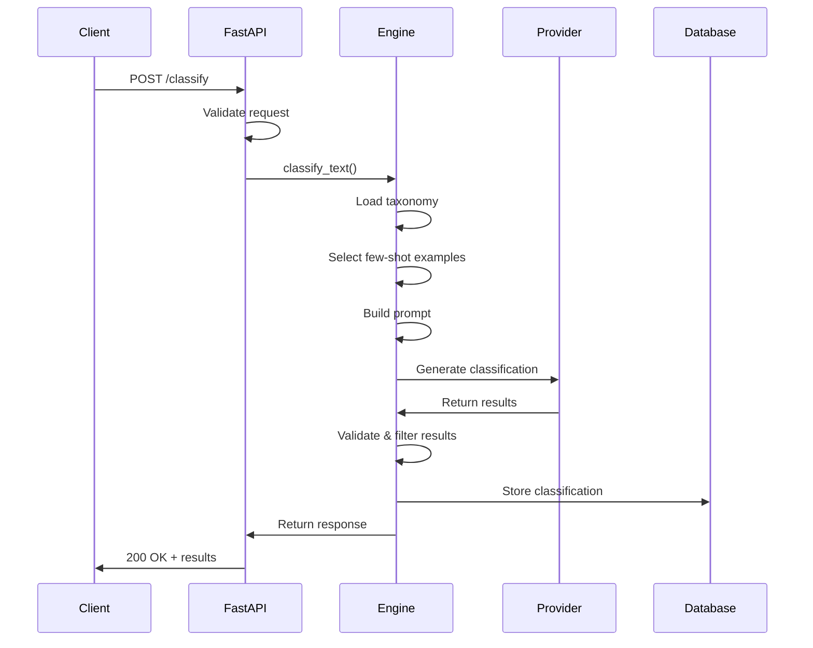
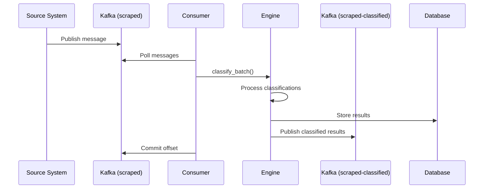
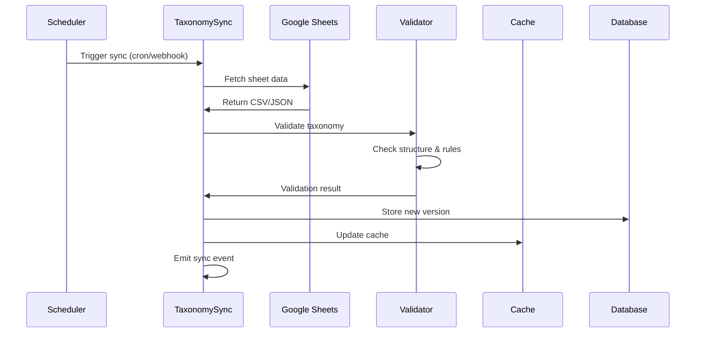

# ClearCategorisationIQ — Architecture Documentation

**Document version:** v1.0  
**Date:** 14 Aug 2025  
**Owner:** Architect  
**Status:** Current  

---

## 1. System Overview

ClearCategorisationIQ is a **microservice-based classification system** designed to categorize unstructured text against hierarchical taxonomies. The system follows a **reactive architecture** with clear separation of concerns and event-driven processing.

### Core Architecture Patterns
- **API-first design** with FastAPI
- **Event-driven processing** via Kafka
- **Pluggable AI providers** through adapter pattern
- **Configuration-driven taxonomy** from Google Sheets
- **Immutable data store** for audit trail

---

## 2. High-Level Architecture

```
┌─────────────────────────────────────────────────────────────────┐
│                    ClearCategorisationIQ                       │
├─────────────────────────────────────────────────────────────────┤
│  ┌─────────────┐    ┌──────────────┐    ┌─────────────────┐     │
│  │   FastAPI   │    │    Kafka     │    │   Google        │     │
│  │  Endpoints  │    │   Consumer   │    │   Sheets        │     │
│  │             │    │              │    │   Taxonomy      │     │
│  └─────────────┘    └──────────────┘    └─────────────────┘     │
│         │                   │                      │            │
│         v                   v                      │            │
│  ┌─────────────────────────────────────────────────v────────┐   │
│  │              Classification Engine              │        │   │
│  │  ┌──────────────┐  ┌────────────────────────────┐      │   │
│  │  │ Provider     │  │ Few-shot Prompt Builder    │      │   │
│  │  │ Adapters     │  │                            │      │   │
│  │  │ - OpenAI     │  │ - Taxonomy Context         │      │   │
│  │  │ - Ollama     │  │ - Example Selection        │      │   │
│  │  └──────────────┘  └────────────────────────────┘      │   │
│  └─────────────────────────────────────────────────────────┘   │
│         │                   │                                  │
│         v                   v                                  │
│  ┌─────────────┐    ┌──────────────┐                          │
│  │   Result    │    │   Kafka      │                          │
│  │ Validation  │    │  Producer    │                          │
│  │             │    │              │                          │
│  └─────────────┘    └──────────────┘                          │
│         │                   │                                  │
│         v                   v                                  │
│  ┌─────────────────────────────────────────────────────────┐   │
│  │                PostgreSQL                              │   │
│  │  ┌─────────────┐  ┌─────────────┐  ┌─────────────────┐ │   │
│  │  │  articles   │  │few_shots    │  │ classifications │ │   │
│  │  │             │  │             │  │                 │ │   │
│  │  └─────────────┘  └─────────────┘  └─────────────────┘ │   │
│  └─────────────────────────────────────────────────────────┘   │
└─────────────────────────────────────────────────────────────────┘

    External Dependencies:
    ┌─────────────┐  ┌─────────────┐  ┌─────────────┐
    │   Redis     │  │   Kafka     │  │ AI Provider │
    │   Cache     │  │  Cluster    │  │ APIs        │
    └─────────────┘  └─────────────┘  └─────────────┘
```

---

## 3. Component Architecture

### 3.1 API Layer (FastAPI)

**Responsibility**: HTTP interface for synchronous classification requests

```python
# Core API Components
├── routers/
│   ├── classify.py          # /classify, /classify/batch
│   ├── taxonomy.py          # /taxonomy/version, /taxonomy/preview
│   ├── admin.py             # /healthz, /readyz, /providers
│   └── articles.py          # /articles/{id}/classifications
├── middleware/
│   ├── auth.py              # API key / OIDC validation
│   ├── rate_limit.py        # Request throttling
│   └── logging.py           # Structured JSON logging
└── models/
    ├── requests.py          # Pydantic request models
    └── responses.py         # Pydantic response models
```

**Key Characteristics**:
- **Stateless**: No session state maintained
- **Async**: Fully async/await for I/O operations
- **Resilient**: Circuit breakers for external dependencies
- **Observable**: Structured logging with correlation IDs

### 3.2 Event Processing Layer (Kafka)

**Responsibility**: Asynchronous stream processing for high-volume classification

```python
# Event Processing Components
├── consumers/
│   ├── scraped_consumer.py  # Main Kafka consumer
│   └── base_consumer.py     # Shared consumer logic
├── producers/
│   ├── classified_producer.py # Results publisher
│   └── base_producer.py     # Shared producer logic
└── schemas/
    ├── scraped_message.py   # Input message schema
    └── classified_message.py # Output message schema
```

**Processing Flow**:
1. **Consume** from `scraped` topic
2. **Deserialize** and validate message schema
3. **Classify** text using classification engine
4. **Enrich** with metadata and usage stats
5. **Produce** to `scraped-classified` topic
6. **Persist** to PostgreSQL for audit

### 3.3 Classification Engine (Core Logic)

**Responsibility**: Orchestrates taxonomy resolution, prompt engineering, and AI provider interaction

```python
# Classification Engine Components
├── engine/
│   ├── classifier.py        # Main classification orchestrator
│   ├── taxonomy_resolver.py # Google Sheets integration
│   ├── prompt_builder.py    # Few-shot prompt construction
│   └── result_validator.py  # Output validation & filtering
├── providers/
│   ├── base_provider.py     # Abstract provider interface
│   ├── openai_provider.py   # OpenAI API adapter
│   └── ollama_provider.py   # Ollama local model adapter
└── few_shot/
    ├── example_selector.py  # Dynamic example selection
    └── coverage_tracker.py  # Permutation coverage analysis
```

**Classification Flow**:
1. **Load Taxonomy**: Get current taxonomy version from cache/DB
2. **Select Examples**: Query few-shot examples based on text similarity
3. **Build Prompt**: Construct system prompt + few-shot examples + input
4. **Invoke Provider**: Send to AI provider with retry/fallback logic
5. **Parse Response**: Extract and validate category paths
6. **Apply Filters**: Apply confidence thresholds and business rules
7. **Return Results**: Structured classification response

### 3.4 Data Layer (PostgreSQL + Redis)

**Responsibility**: Persistent storage and caching for performance

#### PostgreSQL Schema
```sql
-- Core entity storage
CREATE TABLE articles (
    article_id VARCHAR PRIMARY KEY,
    source VARCHAR NOT NULL,
    ts TIMESTAMP WITH TIME ZONE NOT NULL,
    text TEXT NOT NULL,
    attrs JSONB DEFAULT '{}',
    ingested_at TIMESTAMP WITH TIME ZONE DEFAULT NOW()
);

CREATE TABLE classifications (
    id BIGSERIAL PRIMARY KEY,
    article_id VARCHAR NOT NULL REFERENCES articles(article_id),
    classification JSONB NOT NULL,
    provider VARCHAR NOT NULL,
    model VARCHAR NOT NULL,
    usage JSONB NOT NULL,
    taxonomy_version VARCHAR NOT NULL,
    processed_ts TIMESTAMP WITH TIME ZONE DEFAULT NOW()
);

-- Few-shot learning support
CREATE TABLE few_shots (
    id BIGSERIAL PRIMARY KEY,
    path_key VARCHAR NOT NULL,
    example_input TEXT NOT NULL,
    example_label_json JSONB NOT NULL,
    explanation TEXT,
    taxonomy_version VARCHAR NOT NULL,
    active BOOLEAN DEFAULT true,
    created_by VARCHAR,
    created_at TIMESTAMP WITH TIME ZONE DEFAULT NOW()
);

-- Taxonomy versioning
CREATE TABLE taxonomy_versions (
    taxonomy_version VARCHAR PRIMARY KEY,
    sheet_etag VARCHAR,
    taxonomy_data JSONB NOT NULL,
    created_at TIMESTAMP WITH TIME ZONE DEFAULT NOW()
);

-- Performance optimization
CREATE INDEX ix_classifications_article_id ON classifications(article_id);
CREATE INDEX ix_few_shots_path_key ON few_shots(path_key) WHERE active;
CREATE INDEX gin_classifications ON classifications USING gin(classification);
```

#### Redis Caching Strategy
```python
# Cache Keys and TTL
taxonomy:current -> current taxonomy version (5min)
taxonomy:{version} -> full taxonomy tree (1hour) 
examples:{path_key} -> few-shot examples (30min)
prompt_cache:{hash} -> rendered prompts (15min)
```

---

## 4. Data Flow Architecture

### 4.1 Synchronous Classification Flow



### 4.2 Asynchronous Stream Processing Flow



### 4.3 Taxonomy Synchronization Flow



---

## 5. Technology Stack & Dependencies

### 5.1 Core Framework
- **FastAPI** 0.104+: High-performance async web framework
- **Pydantic** 2.0+: Data validation and serialization
- **Uvicorn**: ASGI server for production deployment

### 5.2 Data & Messaging
- **PostgreSQL** 15+: Primary data store with JSONB support
- **Redis** 7+: Caching and session storage
- **Kafka** 3.5+: Event streaming platform
- **asyncpg**: High-performance async PostgreSQL driver

### 5.3 AI & ML
- **OpenAI Python SDK**: Cloud AI provider integration
- **httpx**: HTTP client for Ollama integration
- **tiktoken**: Token counting for cost estimation
- **sentence-transformers**: Embedding models for similarity search

### 5.4 Operations & Monitoring
- **structlog**: Structured logging with JSON output
- **prometheus-client**: Metrics collection (future)
- **alembic**: Database migration management
- **pytest**: Testing framework

---

## 6. Scalability & Performance

### 6.1 Horizontal Scaling Points

**API Layer**:
- Stateless FastAPI instances behind load balancer
- Auto-scaling based on CPU/memory metrics
- Connection pooling for database access

**Event Processing**:
- Multiple Kafka consumer instances per consumer group
- Partition-based parallelism (scale by topic partitions)
- Independent scaling from API layer

**Database Layer**:
- Read replicas for analytics workloads
- Partitioning of large tables by date
- Connection pooling and prepared statements

### 6.2 Performance Characteristics

**Latency Targets**:
- Synchronous API: p95 < 2s, p99 < 5s
- Stream processing: < 100ms per message (excluding AI call)
- Taxonomy sync: < 30s end-to-end

**Throughput Targets**:
- API: 100 RPS per instance
- Kafka processing: 1000 messages/sec per consumer
- Database writes: 5000 inserts/sec

### 6.3 Caching Strategy

**Multi-Level Caching**:
1. **Application Cache**: In-memory taxonomy and prompts
2. **Redis Cache**: Cross-instance shared state
3. **Database Cache**: PostgreSQL query cache
4. **Provider Cache**: AI response caching (optional)

---

## 7. Security Architecture

### 7.1 Authentication & Authorization

**API Security**:
- API key authentication for service-to-service
- OIDC integration for user-facing tools
- Rate limiting per client/key
- Request/response logging for audit

**Data Security**:
- Encryption at rest (database level)
- Encryption in transit (TLS 1.3)
- PII redaction configurable
- Audit trail for all data access

### 7.2 Network Security

**Network Topology**:
- Private subnets for database and Kafka
- Public subnet for API gateway only
- VPC peering for cross-service communication
- WAF protection for API endpoints

---

## 8. Deployment Architecture

### 8.1 Container Strategy

```dockerfile
# Multi-stage build pattern
FROM python:3.12-slim as base
FROM base as dependencies
FROM dependencies as application
```

**Container Composition**:
- **API Service**: FastAPI application
- **Consumer Service**: Kafka consumer workers  
- **Sync Service**: Taxonomy synchronization job
- **Database**: PostgreSQL with extensions
- **Cache**: Redis with persistence
- **Message Broker**: Kafka cluster

### 8.2 Environment Strategy

**Development**: Docker Compose with local services
**Staging**: Kubernetes with external managed services
**Production**: Kubernetes with high availability

### 8.3 Configuration Management

```python
# Environment-specific configuration
environments/
├── development.yaml
├── staging.yaml
└── production.yaml

# Secret management
secrets/
├── api_keys.yaml
├── database.yaml
└── providers.yaml
```

---

## 9. Monitoring & Observability

### 9.1 Logging Strategy

**Structured JSON Logging**:
```json
{
  "timestamp": "2025-08-14T10:30:00Z",
  "level": "INFO",
  "service": "classification-engine",
  "trace_id": "abc123",
  "event": "classification_completed",
  "article_id": "art-456",
  "provider": "openai",
  "model": "gpt-4o-mini",
  "usage": {"input_tokens": 150, "output_tokens": 20},
  "latency_ms": 1250,
  "taxonomy_version": "tax_v20250814_103000"
}
```

### 9.2 Health Checks

**Endpoint Monitoring**:
- `/healthz`: Basic application health
- `/readyz`: Dependency readiness check
- `/metrics`: Prometheus metrics (future)

**Dependency Checks**:
- Database connectivity
- Redis availability  
- Kafka cluster health
- AI provider status
- Google Sheets accessibility

### 9.3 Alerting Strategy

**Critical Alerts**:
- Service unavailability > 1 minute
- Classification error rate > 5%
- Taxonomy sync failures
- Database connection failures

**Warning Alerts**:
- High latency (p95 > 3s)
- Low cache hit rates
- Provider cost spikes
- Queue backlog growth

---

## 10. Quality & Testing Strategy

### 10.1 Testing Pyramid

**Unit Tests** (70%):
- Taxonomy validation logic
- Prompt building functions
- Provider adapter behavior
- Data model validation

**Integration Tests** (25%):
- API endpoint functionality
- Database operations
- Kafka message flow
- Provider integrations

**End-to-End Tests** (5%):
- Full classification workflow
- Taxonomy sync process
- Error recovery scenarios
- Performance validation

### 10.2 Quality Gates

**Pre-deployment Checks**:
- All tests pass (>95% coverage)
- No critical security vulnerabilities
- Performance benchmarks met
- Database migrations validated

**Post-deployment Validation**:
- Health checks pass
- Sample classifications validate
- No error rate spikes
- Latency within SLA

---

## 11. Risk Management & Resilience

### 11.1 Failure Scenarios & Mitigations

**AI Provider Outage**:
- Multi-provider fallback chain
- Circuit breaker pattern
- Graceful degradation modes
- Cost spike protection

**Database Failure**:
- Read replica failover
- Connection pool management
- Write-ahead logging
- Backup/restore procedures

**Taxonomy Corruption**:
- Schema validation checks
- Version rollback capability
- Manual override mechanisms
- Data integrity monitoring

### 11.2 Disaster Recovery

**Recovery Time Objectives**:
- RTO: 15 minutes for critical services
- RPO: 5 minutes for data loss
- Automated failover where possible
- Documented manual procedures

---

## 12. Future Architecture Evolution

### 12.1 Planned Enhancements

**Phase 2** (3-6 months):
- Active learning feedback loop
- Model fine-tuning pipeline
- Advanced prompt optimization
- Multi-language support

**Phase 3** (6-12 months):
- Custom model training
- Federated learning capabilities
- Real-time personalization
- Advanced analytics dashboard

### 12.2 Scalability Roadmap

**Scale Targets**:
- 10x throughput (10K RPS)
- 100x data volume (1TB/day)
- Multi-region deployment
- 99.99% availability SLA

---

## 13. Decision Log

### 13.1 Architecture Decisions

**ADR-001**: Microservice vs Monolith
- **Decision**: Microservice architecture
- **Rationale**: Independent scaling, technology diversity, team autonomy
- **Trade-offs**: Complexity vs flexibility

**ADR-002**: Event-Driven vs Request-Response
- **Decision**: Hybrid approach (both patterns)
- **Rationale**: Sync for immediate needs, async for high volume
- **Trade-offs**: Complexity vs performance

**ADR-003**: Database Choice
- **Decision**: PostgreSQL with JSONB
- **Rationale**: Relational + document flexibility, mature ecosystem
- **Trade-offs**: Single database vs polyglot persistence

### 13.2 Technology Decisions

**TDR-001**: FastAPI vs Django/Flask
- **Decision**: FastAPI
- **Rationale**: Performance, async support, OpenAPI integration
- **Trade-offs**: Maturity vs modern features

**TDR-002**: Kafka vs RabbitMQ/SQS
- **Decision**: Kafka
- **Rationale**: High throughput, durability, stream processing
- **Trade-offs**: Complexity vs capability

---

## 14. Appendix

### 14.1 Glossary

**Terms**:
- **Taxonomy Version**: Immutable snapshot of classification hierarchy
- **Path Key**: Hierarchical identifier (e.g., "tier1/tier2/tier3")  
- **Few-Shot Example**: Training example for prompt engineering
- **Provider Adapter**: Abstraction layer for AI service integration
- **Classification Result**: Structured output with confidence and reasoning

### 14.2 References

- [PRD Document](./prd.md)
- [API Specification](./api-spec.yaml)
- [Database Schema](./schema.sql)
- [Deployment Guide](./deployment.md)

---

**End of Architecture Documentation**